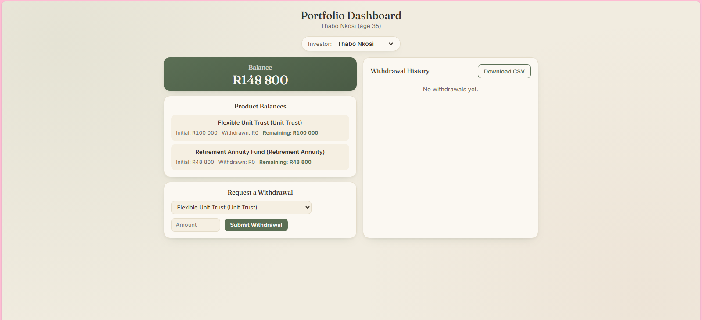
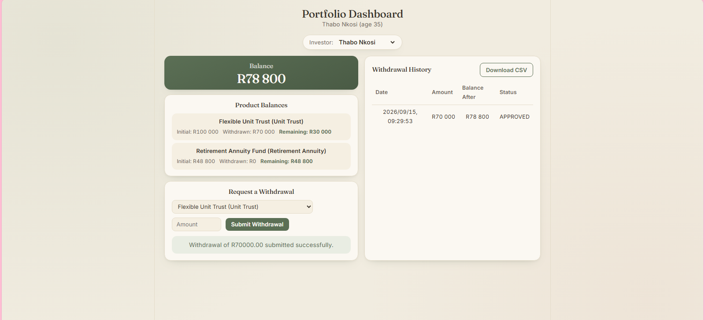
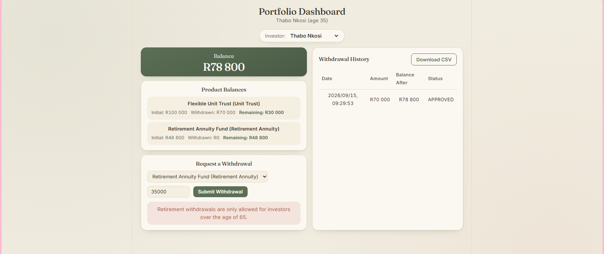
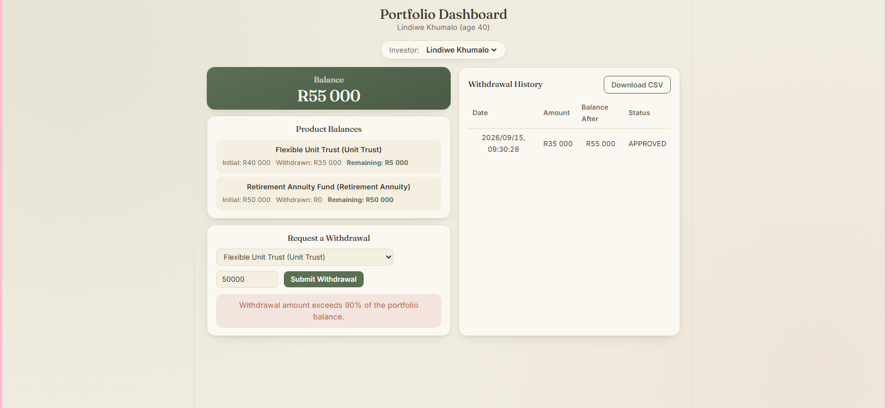
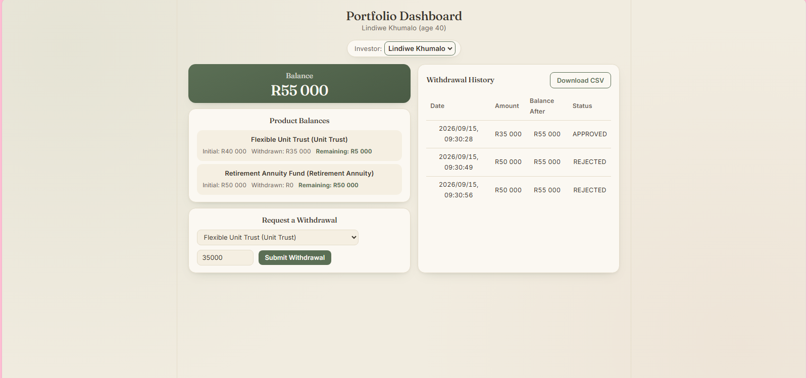
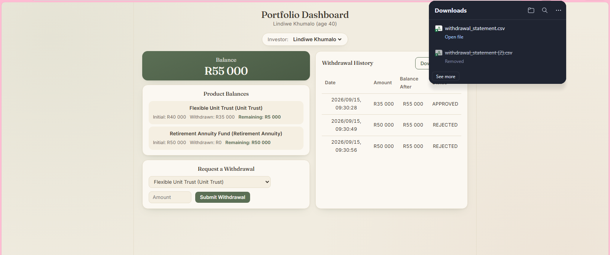
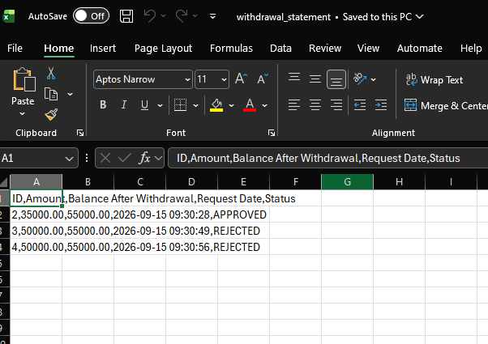
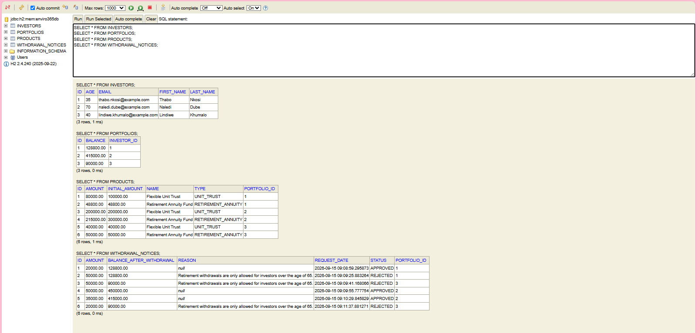

# Enviro365 Investments — Withdrawal Notice System

Junior Developer Assessment (eTalente, June 2026) — full-stack submission.

Investors select their profile, view their own portfolio, submit withdrawal
notices against the business rules below, review their withdrawal history,
and download a CSV statement.

## Folder structure

## Quick start

Start the backend first:

```bash
cd NompumeleloNzama
./mvnw spring-boot:run
```

Confirm it's running at `http://localhost:8080`. On startup, the console
will print a confirmation that the seed investors were loaded.

In a separate terminal, start the frontend:

```bash
cd frontend
npm install
npm run dev
```

Open the URL it prints (usually `http://localhost:5173`) in your browser.

Use the **Investor** dropdown at the top of the dashboard to switch between
seeded investors. The dashboard updates to show only that investor's own
portfolio.

## Investor test data at a glance

| Investor         | Age | Product mix                                | What it tests |
|-------------------|-----|---------------------------------------------|----------------|
| Thabo Nkosi       | 35  | Flexible Unit Trust, Retirement Annuity Fund | Retirement withdrawal rejected (under 65) |
| Naledi Dube       | 70  | Flexible Unit Trust, Retirement Annuity Fund | Retirement withdrawal allowed (over 65) |
| Lindiwe Khumalo   | 40  | Flexible Unit Trust, Retirement Annuity Fund | Retirement withdrawal rejected; also demonstrates the 90% withdrawal cap |

## Demo walkthrough (for someone reviewing this for the first time)

1. Start the backend (`./mvnw spring-boot:run`) and confirm the console
   shows the seed message.
2. Start the frontend (`npm run dev` inside `frontend/`).
3. Use the **Investor** dropdown to select a profile — e.g. Thabo Nkosi, to
   see the portfolio and rejection case for an under-65 retirement
   withdrawal.
4. On the dashboard, review the portfolio — you should see the selected
   investor's products and balances only (not any other investor's).
5. Submit a withdrawal notice against one of the listed products.
   - If the product is a Retirement Annuity and the investor is 65 or
     under, the request is rejected with a clear error message.
   - If the amount exceeds 90% of the portfolio balance, it's rejected
     regardless of product type.
   - Otherwise, it succeeds and appears in the withdrawal history table.
6. Use the **Download CSV** button to export the withdrawal history —
   optionally filter by status first.
7. Switch to a different investor in the dropdown to see the other cases.

## What's included

### Backend
- Retrieves an investor's own portfolio (details + products)
- Creates withdrawal notices with full balance calculations
- Exports CSV statements with optional status filtering
- Enforces all business rules: sufficient balance, 90% withdrawal cap,
  and the retirement age restriction (over 65 only)
- Centralized input validation and global exception handling

### Frontend
- Portfolio dashboard (React + Vite) with an investor selector
- Withdrawal form, withdrawal history table, and a CSV download button —
  all scoped to the selected investor

**Advanced requirements implemented (3 of 5):** global exception handling,
input validation, unit tests. See `DOCUMENTATION.md` for full detail.

## API overview

See `DOCUMENTATION.md` for the full endpoint list, request/response shapes,
and business rule breakdown. In brief:

- `GET /api/portfolio/investor/{investorId}` — fetch an investor's products
- `GET /api/withdrawals/history/{portfolioId}` — fetch withdrawal history
- `POST /api/withdrawals` — submit a new withdrawal notice
- `GET /api/withdrawals/export/{portfolioId}` — download a CSV statement

## Screenshots

**Portfolio dashboard**


**Successful withdrawal (Thabo Nkosi, Unit Trust)**


**Age restriction rejection (Thabo Nkosi, age 35, Retirement Annuity)**


**90% withdrawal limit exceeded (Lindiwe Khumalo)**


**Withdrawal history — approved and rejected notices**


**CSV statement download**


**CSV opened in Excel**


**H2 console — seeded data**


## AI usage disclosure

AI assistance was used to help draft boilerplate, documentation, input
validation, and to review the project against the assessment brief. All
business logic and validation rules were reviewed and verified manually.